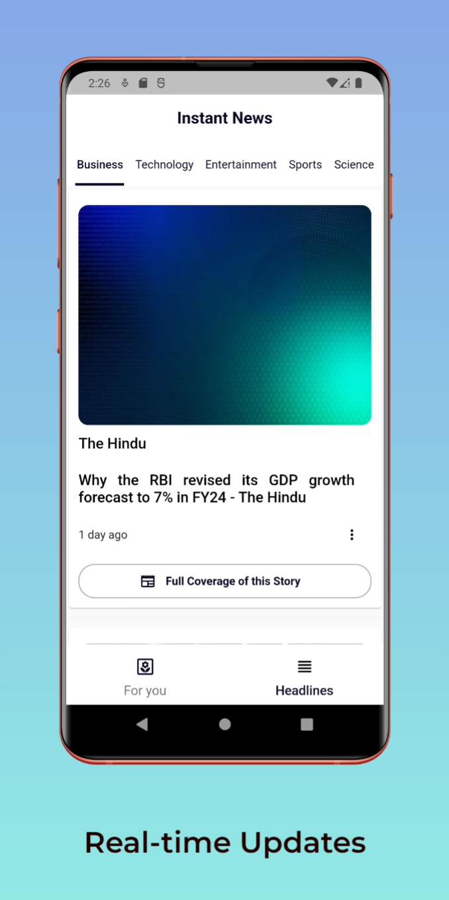
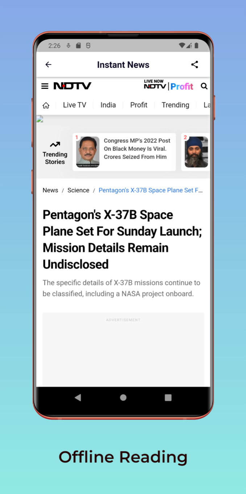

# Flutter News App with News API Integration made by Anikit Grover 📰🔒

Welcome to the InstantNews App, a feature-rich mobile application that provides real-time news updates with latest updates. 

## Key Features

- **Real-time News Updates:** Stay informed with the latest news articles from diverse categories, all in one place.
- **Personalized Recommendations:** Discover news articles tailored to your interests, with intelligent recommendations that adapt to your reading habits.
- **Offline Reading:** Save articles to read later, even without an internet connection.
- **Sharing and Interaction:** Share articles with friends and engage in lively discussions with other users.

## Demo (Inside Screenshots folder also , apk also is attached)
[Live Demo](https://www.youtube.com/channel/UCzwhPwhZJ5kZuKxHPQipOKw)

# Android Screen

 

### Created & Maintained By

[Anikit Grover](https://github.com/AnikitDeveloper96)

## Show Support
* [Recommend Me On LinkedIn](https://in.linkedin.com/in/anikit-grover)
* Don't forget to star ⭐ the repo 😉, it's FREE.

## Feedback and Contributions

We value your feedback and contributions. If you have suggestions or want to contribute to this project, please feel free to reach out.

Let's make staying updated a delightful experience together! 🌍📲
# Instant_News_App
